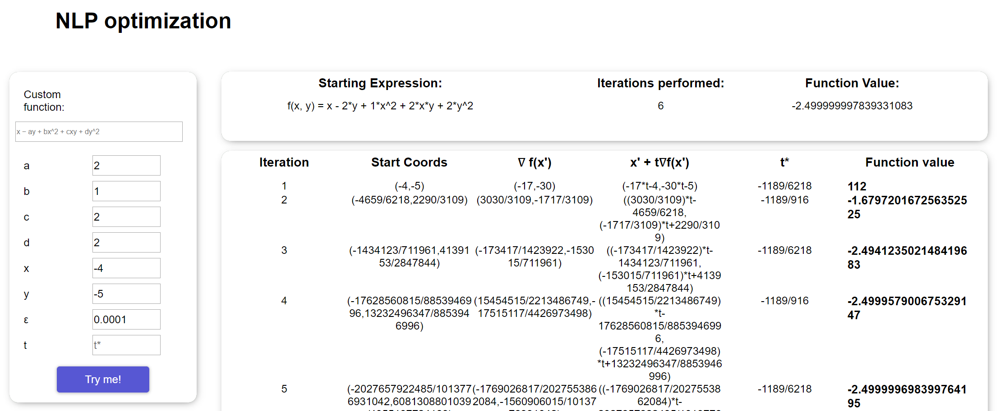

# A simple frontend for Minimizing/Maximizing Non-restricted Linear Programming functions with two variables

## More on Linear Programming [Here](https://en.wikipedia.org/wiki/Linear_programming)

## You have the option to build out a function based on the template function by providing arguments a,b,c,d | starting coordinates x,y. Additionally, you can specify precision and constant t step, which by default is dynamic. All unentered arguments are defaulted to "1".

## As a result, an iteration table is generated with baseline 10 iterations. If by then the precision target was not met, a button appears to perform 10 more iterations per request.s
